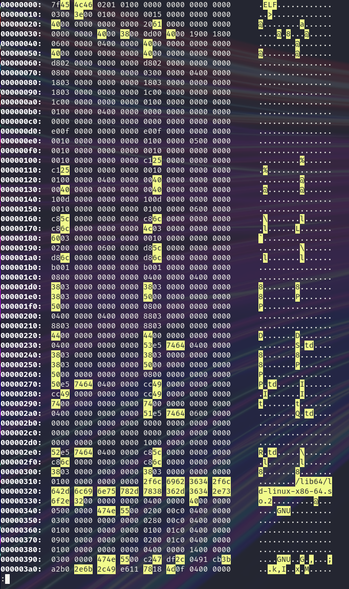
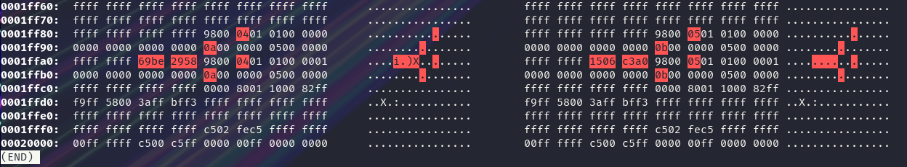

# HexUtils

A small collection of hex / binary analysis utilities

## Contents

- `xd` - an Hex visualizer
- `xdiff` - an Hex differ

## `xd`

### Usage

```bash
$ xd /bin/bash | head -n3
00000000:  7f45 4c46 0201 0100 0000 0000 0000 0000      .ELF............
00000010:  0300 3e00 0100 0000 f018 0200 0000 0000      ..>.............
00000020:  4000 0000 0000 0000 1073 0e00 0000 0000      @........s......
```

### Examples




## `xdiff`

### Usage

```bash
$ xdiff resources/example-1/1.bin resources/example-1/2.bin
00000000:  0001 0203 0405 0600 0000 0000 0000 0000      ................        0001 0103 0405 0600 0000 0000 0000 0000 ................
```

### Examples

